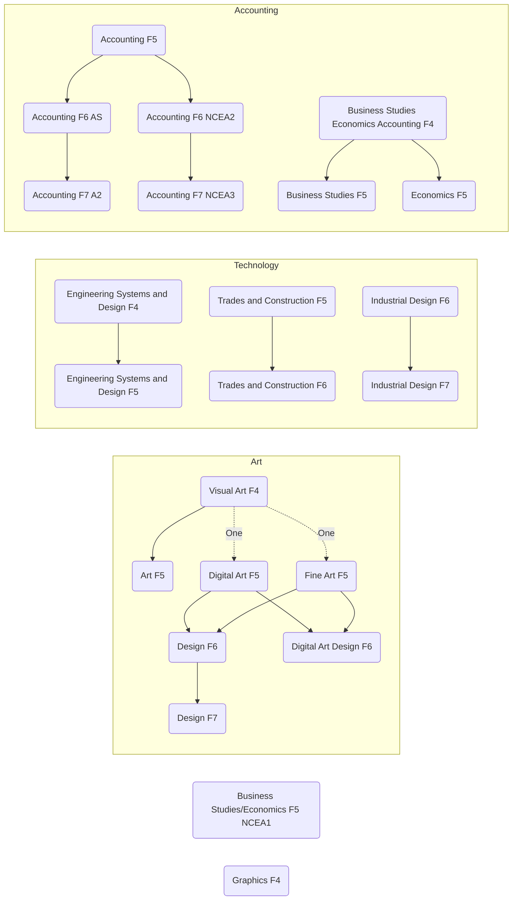

```mermaid
graph LR
    ACC5(Accounting F5)
    ACC6A(Accounting F6 AS)
    ACC6N(Accounting F6 NCEA2)
    ACC7A(Accounting F7 A2)
    ACC7N(Accounting F7 NCEA3)
    ART5(Art F5)
    BEA4(Business Studies Economics Accounting F4)
    BUS5(Business Studies F5)
    COM5(Business Studies/Economics F5 NCEA1)
    CON5(Trades and Construction F5)
    CON6(Trades and Construction F6)
    DAD6(Digital Art Design F6)
    DAR5(Digital Art F5)
    DES6(Design F6)
    DES7(Design F7)
    ECO5(Economics F5)
    ESD4(Engineering Systems and Design F4)
    ESD5(Engineering Systems and Design F5)
    FAR5(Fine Art F5)
    GRA4(Graphics F4)
    IND6(Industrial Design F6)
    IND7(Industrial Design F7)
    VIS4(Visual Art F4)

    subgraph Art
        VIS4 --> ART5
        VIS4 -.->|One| DAR5
        VIS4 -.->|One| FAR5
        DAR5 --> DES6
        FAR5 --> DES6
        DAR5 --> DAD6
        FAR5 --> DAD6
        DES6 --> DES7
    end

    subgraph Technology
        ESD4 --> ESD5
        CON5 --> CON6
        IND6 --> IND7
    end

    subgraph Accounting
        ACC5 --> ACC6A --> ACC7A
        ACC5 --> ACC6N --> ACC7N
        BEA4 --> BUS5
        BEA4 --> ECO5
    end

```
