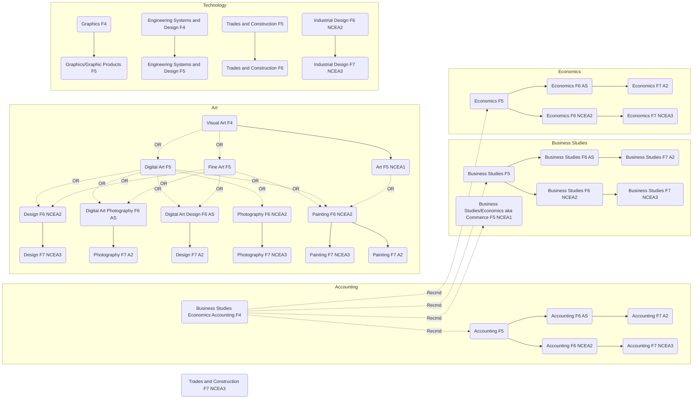

```mermaid
graph LR
    4BEA(Business Studies Economics Accounting F4)
    4ESD(Engineering Systems and Design F4)
    4GRA(Graphics F4)
    4VIS(Visual Art F4)
    5ACC(Accounting F5)
    5ART-N(Art F5 NCEA1)
    5BUS(Business Studies F5)
    5COM(Business Studies/Economics aka Commerce F5 NCEA1)
    5CON(Trades and Construction F5)
    5DAR(Digital Art F5)
    5ECO(Economics F5)
    5ESD(Engineering Systems and Design F5)
    5FAR(Fine Art F5)
    5GRA(Graphics/Graphic Products F5)
    6ACC-A(Accounting F6 AS)
    6ACC-N(Accounting F6 NCEA2)
    6BUS-A(Business Studies F6 AS)
    6BUS-N(Business Studies F6 NCEA2)
    6CON(Trades and Construction F6)
    6DAD(Digital Art Design F6 AS)
    6DAP-A(Digital Art Photography F6 AS)
    6DES(Design F6 NCEA2)
    6ECO-A(Economics F6 AS)
    6ECO-N(Economics F6 NCEA2)
    6IND(Industrial Design F6 NCEA2)
    6PHO-N(Photography F6 NCEA2)
    6PTG(Painting F6 NCEA2)
    7ACC-A(Accounting F7 A2)
    7ACC-N(Accounting F7 NCEA3)
    7BUS-A(Business Studies F7 A2)
    7BUS-N(Business Studies F7 NCEA3)
    7CON(Trades and Construction F7 NCEA3)
    7DES-N(Design F7 NCEA3)
    7DES-A(Design F7 A2)
    7ECO-A(Economics F7 A2)
    7ECO-N(Economics F7 NCEA3)
    7IND(Industrial Design F7 NCEA3)
    7PHO-N(Photography F7 NCEA3)
    7PHO-A(Photography F7 A2)
    7PTG-A(Painting F7 A2)
    7PTG-N(Painting F7 NCEA3)
    

    subgraph Accounting
        4BEA -.->|Recmd| 5ACC
        5ACC --> 6ACC-A --> 7ACC-A
        5ACC --> 6ACC-N --> 7ACC-N
    end

    subgraph Business Studies
        4BEA -.->|Recmd| 5COM
        4BEA -.->|Recmd| 5BUS
        5BUS --> 6BUS-A --> 7BUS-A
        5BUS --> 6BUS-N --> 7BUS-N
    end

    subgraph Economics
        4BEA -.->|Recmd| 5ECO
        5ECO --> 6ECO-A --> 7ECO-A
        5ECO --> 6ECO-N --> 7ECO-N
    end

    subgraph Art
        4VIS --> 5ART-N
        4VIS -.->|OR| 5DAR
        4VIS -.->|OR| 5FAR
        5DAR -.->|OR| 6DES
        5FAR -.->|OR| 6DES
        5DAR -.->|OR| 6DAD
        5FAR -.->|OR| 6DAD
        5DAR -.->|OR| 6DAP-A
        5FAR -.->|OR| 6DAP-A
        5DAR -.->|OR| 6PHO-N
        5FAR -.->|OR| 6PTG
        5DAR -.->|OR| 6PTG
        5ART-N -.->|OR| 6PTG
        6DES --> 7DES-N
        6DAP-A --> 7PHO-A
        6DAD --> 7DES-A
        6PHO-N --> 7PHO-N
        6PTG --> 7PTG-N
        6PTG --> 7PTG-A
    end

    subgraph Technology
        4GRA --> 5GRA
        4ESD --> 5ESD
        5CON --> 6CON
        6IND --> 7IND
    end

```
